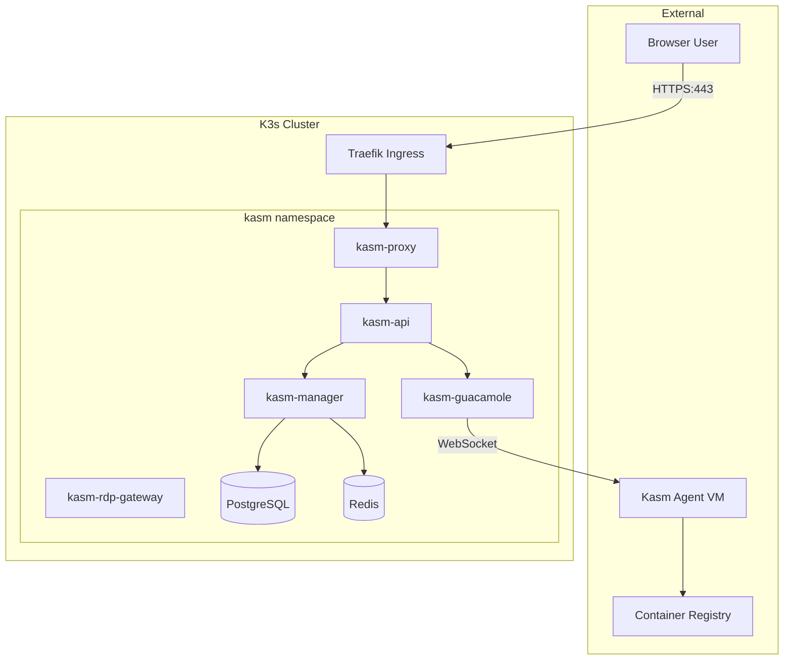
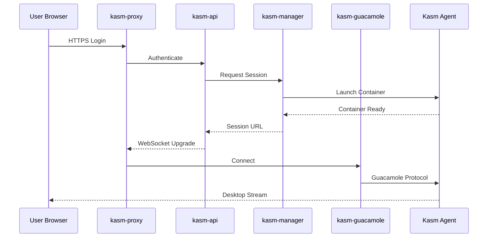

# ADD: Kasm Workspaces on K3s

## Architecture Overview

This document defines the architecture for deploying Kasm Workspaces on a K3s lightweight Kubernetes cluster.

---

## System Context



---

## Component Architecture

### Core Services (Deployed via Helm)

| Component | Purpose | Replicas | Resource Limits |
|-----------|---------|----------|-----------------|
| **kasm-api** | REST API, authentication | 1-3 | 512Mi RAM, 500m CPU |
| **kasm-manager** | Session orchestration | 1 | 256Mi RAM, 250m CPU |
| **kasm-proxy** | Reverse proxy, TLS termination | 1-3 | 256Mi RAM, 250m CPU |
| **kasm-guacamole** | WebSocket gateway for sessions | 1-3 | 512Mi RAM, 500m CPU |
| **kasm-rdp-gateway** | RDP over HTTPS | 1 | 256Mi RAM, 250m CPU |
| **PostgreSQL** | Persistent storage | 1 | 512Mi RAM, 500m CPU |
| **Redis** | Session cache | 1 | 128Mi RAM, 100m CPU |

### External Components (NOT in K3s)

| Component | Purpose | Location |
|-----------|---------|----------|
| **Kasm Agent** | Container session execution | VM/Bare-metal |
| **Workspace Images** | User desktop containers | Agent-local or registry |

> [!IMPORTANT]
> Kasm Agents cannot run inside Kubernetes. They require privileged Docker access on dedicated VMs.

---

## Deployment Topology

### Single-Node K3s (Development)
```
┌─────────────────────────────────────┐
│           K3s Node (4C/8G)          │
│  ┌─────────┐ ┌─────────┐ ┌───────┐  │
│  │kasm-api │ │kasm-mgr │ │ proxy │  │
│  └─────────┘ └─────────┘ └───────┘  │
│  ┌─────────┐ ┌─────────┐ ┌───────┐  │
│  │  guac   │ │postgres │ │ redis │  │
│  └─────────┘ └─────────┘ └───────┘  │
└─────────────────────────────────────┘
            │
            ▼
┌─────────────────────────────────────┐
│         Kasm Agent VM (8C/16G)       │
│    [workspace containers here]       │
└─────────────────────────────────────┘
```

### Multi-Node K3s (Production)
```
┌──────────────┐  ┌──────────────┐  ┌──────────────┐
│  K3s Master  │  │  K3s Worker1 │  │  K3s Worker2 │
│   (control)  │  │  (kasm pods) │  │  (kasm pods) │
└──────────────┘  └──────────────┘  └──────────────┘
        │                │                │
        └────────────────┼────────────────┘
                         ▼
                  ┌─────────────┐
                  │ Kasm Agents │
                  │  (3+ VMs)   │
                  └─────────────┘
```

---

## Data Flow

### Session Launch Sequence


---

## Storage Architecture

### Persistent Volume Claims

| PVC | Purpose | Size | StorageClass |
|-----|---------|------|--------------|
| `kasm-db-pvc` | PostgreSQL data | 10Gi | local-path |
| `kasm-redis-pvc` | Redis persistence | 1Gi | local-path |
| `kasm-config-pvc` | Shared configs | 1Gi | local-path |

### K3s Storage Classes
```yaml
# Default local-path-provisioner (single-node)
storageClassName: local-path

# For multi-node: Longhorn recommended
storageClassName: longhorn
```

---

## Network Architecture

### Ingress Configuration
```yaml
apiVersion: networking.k8s.io/v1
kind: Ingress
metadata:
  name: kasm-ingress
  namespace: kasm
  annotations:
    kubernetes.io/ingress.class: traefik
    traefik.ingress.kubernetes.io/router.tls: "true"
spec:
  tls:
    - hosts:
        - kasm.example.com
      secretName: kasm-tls
  rules:
    - host: kasm.example.com
      http:
        paths:
          - path: /
            pathType: Prefix
            backend:
              service:
                name: kasm-proxy
                port:
                  number: 443
```

### Port Mapping

| Port | Protocol | Service | Notes |
|------|----------|---------|-------|
| 443 | HTTPS | kasm-proxy | Main entry point |
| 3389 | TCP | kasm-rdp-gateway | RDP over HTTPS only |
| 5432 | TCP | postgres | Internal only |
| 6379 | TCP | redis | Internal only |

---

## Security Architecture

### Pod Security

```yaml
securityContext:
  runAsNonRoot: true
  runAsUser: 1000
  readOnlyRootFilesystem: true
  allowPrivilegeEscalation: false
```

### Network Policies
```yaml
apiVersion: networking.k8s.io/v1
kind: NetworkPolicy
metadata:
  name: kasm-db-isolation
  namespace: kasm
spec:
  podSelector:
    matchLabels:
      app: kasm-db
  ingress:
    - from:
        - podSelector:
            matchLabels:
              app: kasm-manager
      ports:
        - port: 5432
```

### Secrets Management
- Database credentials: Kubernetes Secret
- TLS certificates: cert-manager or manual Secret
- API keys: External secrets operator (optional)

---

## Failure Modes

| Failure | Detection | Mitigation |
|---------|-----------|------------|
| **Pod OOMKilled** | `kubectl describe pod` | Increase resource limits |
| **PVC Pending** | `kubectl get pvc` | Fix StorageClass, provision disk |
| **Init Container Stuck** | `Init:X/Y` status | Check logs, fix dependencies |
| **DB Connection Failed** | API logs | Verify postgres pod, check secrets |
| **Ingress 502/504** | User reports | Check proxy pod, service endpoints |
| **Agent Unreachable** | Manager logs | Network/firewall between k3s and agent |

---

## Design Decisions

| Decision | Rationale | Trade-off |
|----------|-----------|-----------|
| K3s over K8s | Lightweight, single-binary | Less ecosystem tooling |
| local-path storage | Simple, no external dependencies | No replication, single-node only |
| Traefik ingress | Built into K3s | Less flexible than nginx-ingress |
| External Agents | Kasm architecture requirement | Network complexity |
| PostgreSQL in-cluster | Simplicity | Consider managed DB for production |

---

## Scaling Considerations

### Horizontal Pod Autoscaler
```yaml
apiVersion: autoscaling/v2
kind: HorizontalPodAutoscaler
metadata:
  name: kasm-api-hpa
spec:
  scaleTargetRef:
    apiVersion: apps/v1
    kind: Deployment
    name: kasm-api
  minReplicas: 1
  maxReplicas: 5
  metrics:
    - type: Resource
      resource:
        name: cpu
        target:
          type: Utilization
          averageUtilization: 70
```

### Capacity Planning

| Users | K3s Nodes | Agent VMs | DB Storage |
|-------|-----------|-----------|------------|
| 1-10 | 1 | 1 | 10Gi |
| 10-50 | 3 | 3 | 50Gi |
| 50-200 | 5 | 10 | 200Gi |
